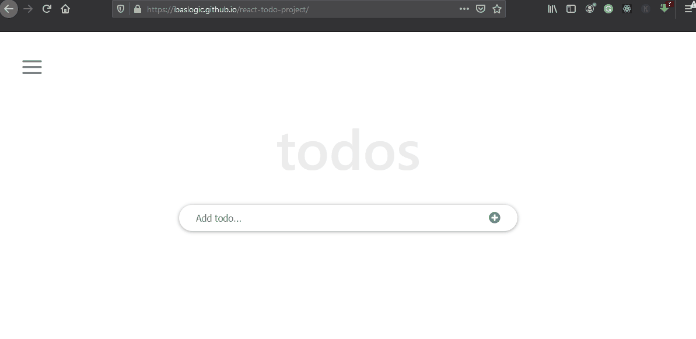

## Built With
- React Js
- React & Redux linters
## Live Demo
> ###### [LIVE DEMO LINK](https://olivier-todo-app.netlify.app)

## Getting Started
- clone the repository by running\
- navigate to the folder\
    `cd math-magicians`
- Install packages\
    `npm install`
- Run the app\
    `npm start`
- Eject the app\
    `npm run eject`
- Create build app\
    `npm run build`
- Test Linters app\
    `npm run check-linters`

## Authors 

👤 **Olivier Gasominali**
- GitHub: [@GOlivierNation](https://github.com/GOlivierNation)
- Twitter: [@GOlivierNation](https://twitter.com/OGasominali)
- LinkedIn: [Olivier GASOMINALI](https://www.linkedin.com/in/olivier-gasominali-866962108/)

## :handshake: Contributing
Contributions, issues, and feature requests are welcome!
## Show your support
Give a :star:️ if you like this project!
## :memo: License
This project is [MIT](./MIT.md) licensed.
